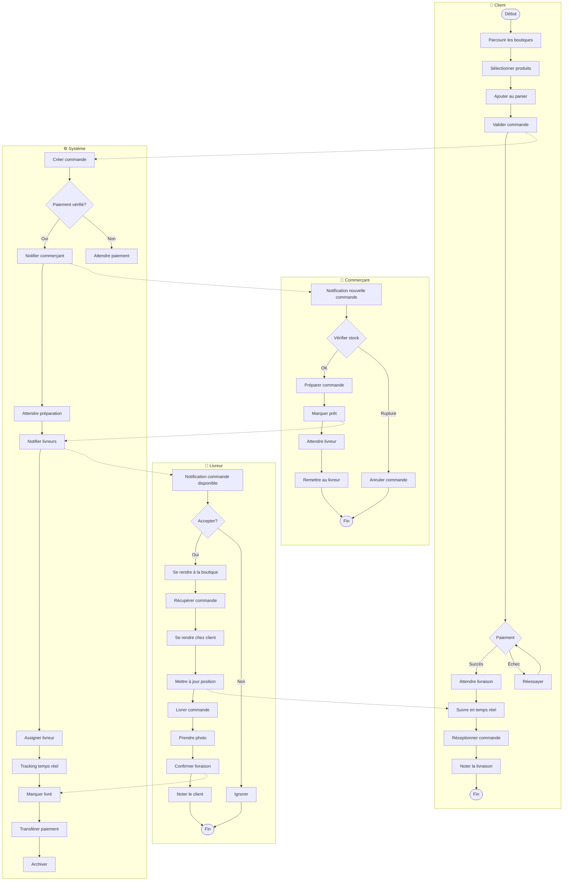
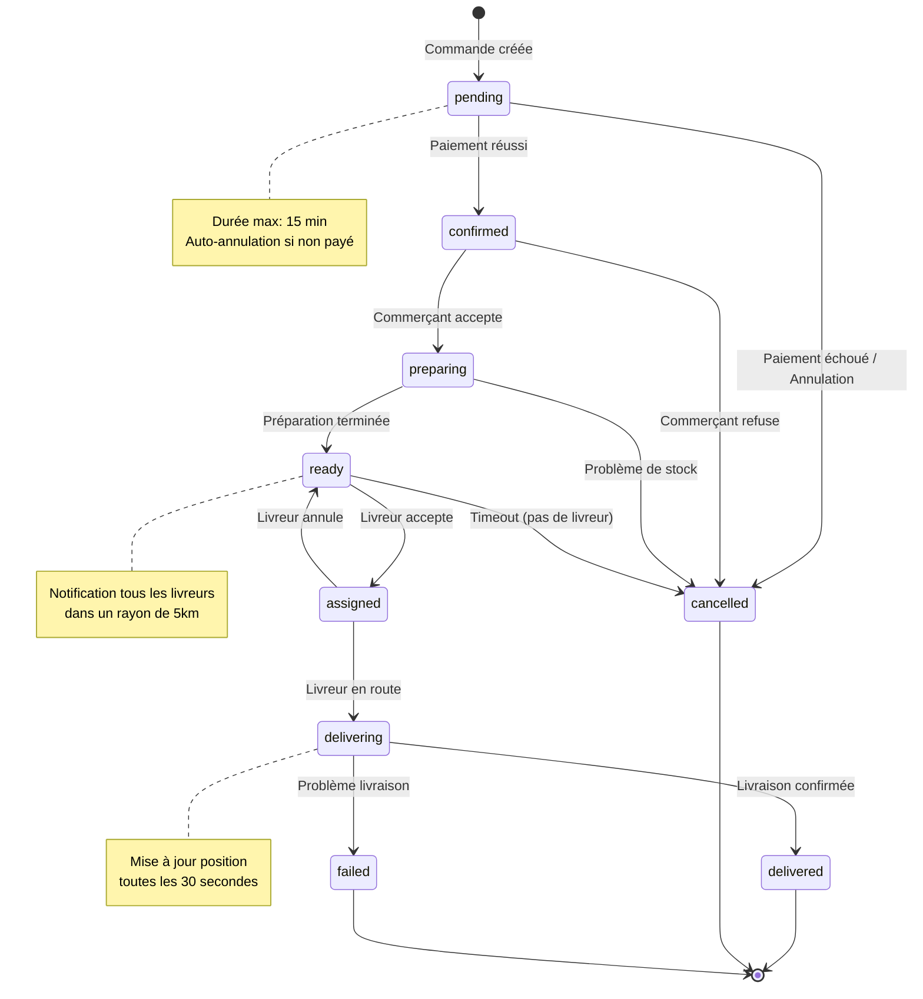
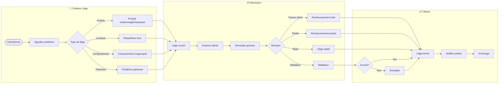
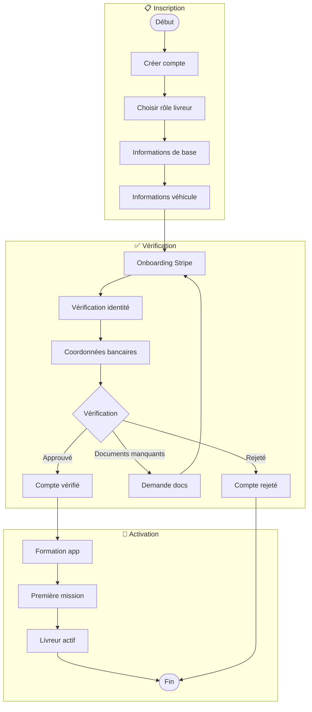

# Diagramme BPMN - Processus de Commande GreenDrop

Ce document décrit le processus métier de commande du point de vue des différents acteurs.

## Processus Principal de Commande

## États de la Commande (State Machine)

## Processus de Litige

## Processus d'Onboarding Livreur

## Métriques Clés (KPIs)

| Métrique | Description | Objectif |
|----------|-------------|----------|
| **Temps moyen de livraison** | De la commande à la livraison | < 45 min |
| **Taux d'acceptation livreur** | Commandes acceptées / proposées | > 80% |
| **Taux de satisfaction client** | Notes 4-5 étoiles | > 90% |
| **Taux de litiges** | Litiges / commandes totales | < 2% |
| **Taux de résolution** | Litiges résolus favorablement | > 95% |
| **Temps d'onboarding livreur** | Inscription à première mission | < 48h |

## Règles Métier

### Commandes
- Commande annulée automatiquement après 15 min sans paiement
- Remboursement automatique si annulation avant préparation
- Frais de livraison fixe de 5€

### Livreurs
- Rayon de notification : 5 km
- Commission livreur : calculée par Stripe Connect
- Minimum 3.5 étoiles pour rester actif

### Litiges
- Délai de signalement : 24h après livraison
- Délai de résolution : 72h maximum
- Remboursement automatique si pas de réponse sous 48h
