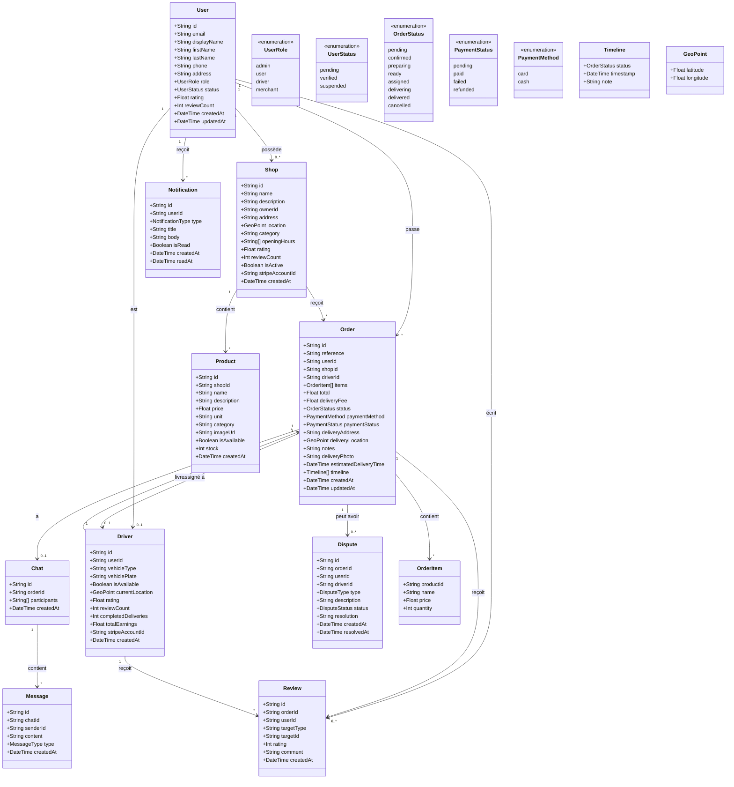

# Diagramme de Classes - GreenDrop

Ce diagramme représente les entités principales du système GreenDrop et leurs relations.

## Description des Entités

### User (Utilisateur)
Représente tous les utilisateurs du système avec leurs informations de profil et leur rôle (admin, user, driver, merchant).

### Order (Commande)
Entité centrale représentant une commande avec son cycle de vie complet, du panier à la livraison.

### Shop (Boutique)
Boutique/commerce partenaire qui propose des produits. Appartient à un merchant.

### Product (Produit)
Article disponible à la vente dans une boutique.

### Driver (Livreur)
Profil spécifique aux utilisateurs ayant le rôle de livreur, avec leurs informations de véhicule et statistiques.

### Review (Avis)
Système d'évaluation permettant aux clients de noter les livreurs/boutiques et aux livreurs de noter les clients.

### Chat / Message
Système de messagerie en temps réel lié à une commande.

### Dispute (Litige)
Gestion des réclamations et problèmes sur les commandes.

### Notification
Système de notifications push pour informer les utilisateurs.
