# Diagramme de Déploiement - GreenDrop

## Architecture Cloud


## Architecture Détaillée

```mermaid
flowchart TB
    subgraph Clients["📱 Clients"]
        iOS["iOS App\n(Swift/SwiftUI)"]
        Web["Admin Dashboard\n(Next.js)"]
    end

    subgraph Vercel["☁️ Vercel Platform"]
        subgraph Edge["Edge Network (Global)"]
            CDN["CDN\n(Static Assets)"]
            Middleware["Edge Middleware\n(Auth check)"]
        end

        subgraph Serverless["Serverless Functions"]
            API_Orders["API: /orders\n(CRUD commandes)"]
            API_Shops["API: /shops\n(Géolocalisation)"]
            API_Drivers["API: /drivers\n(Location updates)"]
            API_Payments["API: /payments\n(Stripe intents)"]
            API_Reviews["API: /reviews\n(Évaluations)"]
            API_Export["API: /users/export\n(RGPD)"]
            API_Upload["API: /upload\n(Files)"]
            API_Notif["API: /notifications\n(FCM)"]
            Webhook["Stripe Webhook\n(Events handler)"]
        end
    end

    subgraph Firebase["🔥 Firebase / GCP"]
        Auth["Firebase Auth\n(JWT tokens)"]
        Firestore["Cloud Firestore\n(Real-time DB)"]
        Storage["Cloud Storage\n(Images/Files)"]
        FCM["Cloud Messaging\n(Push notifications)"]
    end

    subgraph Stripe["💳 Stripe"]
        Payments["Payments API\n(PaymentIntents)"]
        Connect["Stripe Connect\n(Marketplace)"]
        Webhooks_Stripe["Webhooks\n(payment.succeeded)"]
    end

    %% Client connections
    iOS -->|REST API| Middleware
    iOS -->|Real-time| Firestore
    iOS -->|Auth| Auth
    iOS -->|Push| FCM

    Web -->|REST API| Middleware
    Web -->|Real-time| Firestore

    %% Middleware to API
    Middleware --> API_Orders
    Middleware --> API_Shops
    Middleware --> API_Drivers
    Middleware --> API_Payments
    Middleware --> API_Reviews
    Middleware --> API_Export
    Middleware --> API_Upload
    Middleware --> API_Notif

    %% API to Firebase
    API_Orders --> Firestore
    API_Shops --> Firestore
    API_Drivers --> Firestore
    API_Reviews --> Firestore
    API_Export --> Firestore
    API_Upload --> Storage
    API_Notif --> FCM

    %% Stripe flow
    API_Payments --> Payments
    API_Payments --> Connect
    Webhooks_Stripe --> Webhook
    Webhook --> Firestore

    %% Auth validation
    API_Orders -.->|Verify JWT| Auth
    API_Payments -.->|Verify JWT| Auth

    classDef client fill:#e1f5fe
    classDef vercel fill:#f3e5f5
    classDef firebase fill:#fff3e0
    classDef stripe fill:#e8f5e9

    class iOS,Web client
    class CDN,Middleware,API_Orders,API_Shops,API_Drivers,API_Payments,API_Reviews,API_Export,API_Upload,API_Notif,Webhook vercel
    class Auth,Firestore,Storage,FCM firebase
    class Payments,Connect,Webhooks_Stripe stripe
```



## Sécurité et Flux de Données


## Collections Firestore


## Environnements

| Environnement | URL | Firebase Project | Stripe |
|---------------|-----|------------------|--------|
| Development | localhost:3000 | greendrop-dev | Test keys |
| Staging | staging.greendrop.app | greendrop-staging | Test keys |
| Production | greendrop.app | greendrop-prod | Live keys |

## Variables d'Environnement Requises

```env
# Firebase Client
NEXT_PUBLIC_FIREBASE_API_KEY=
NEXT_PUBLIC_FIREBASE_AUTH_DOMAIN=
NEXT_PUBLIC_FIREBASE_PROJECT_ID=
NEXT_PUBLIC_FIREBASE_STORAGE_BUCKET=
NEXT_PUBLIC_FIREBASE_MESSAGING_SENDER_ID=
NEXT_PUBLIC_FIREBASE_APP_ID=

# Firebase Admin (Server-side)
FIREBASE_ADMIN_PROJECT_ID=
FIREBASE_ADMIN_CLIENT_EMAIL=
FIREBASE_ADMIN_PRIVATE_KEY=

# Stripe
STRIPE_SECRET_KEY=
STRIPE_WEBHOOK_SECRET=
NEXT_PUBLIC_STRIPE_PUBLISHABLE_KEY=
```
