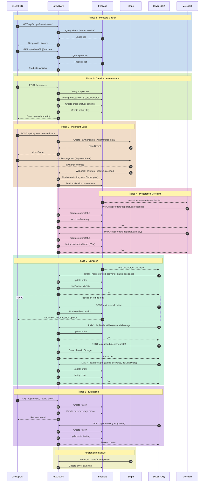
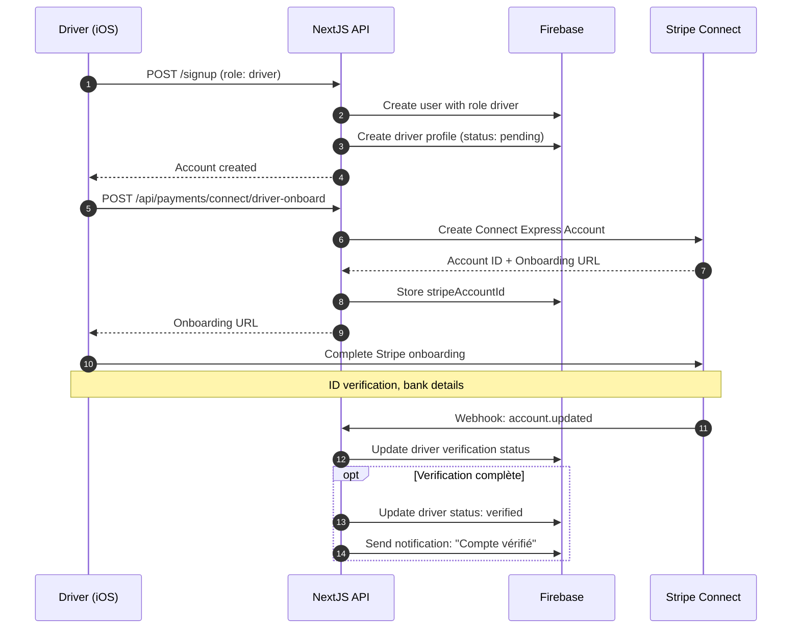
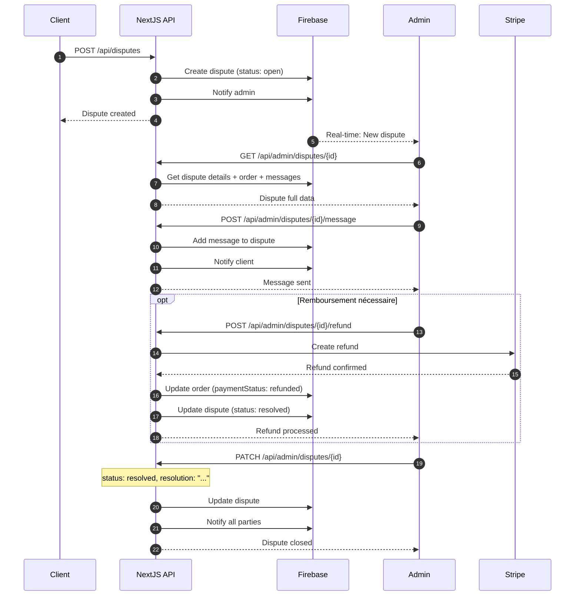
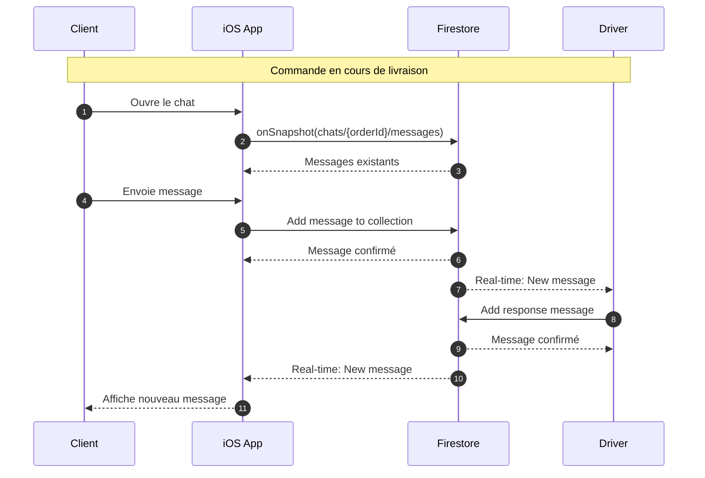
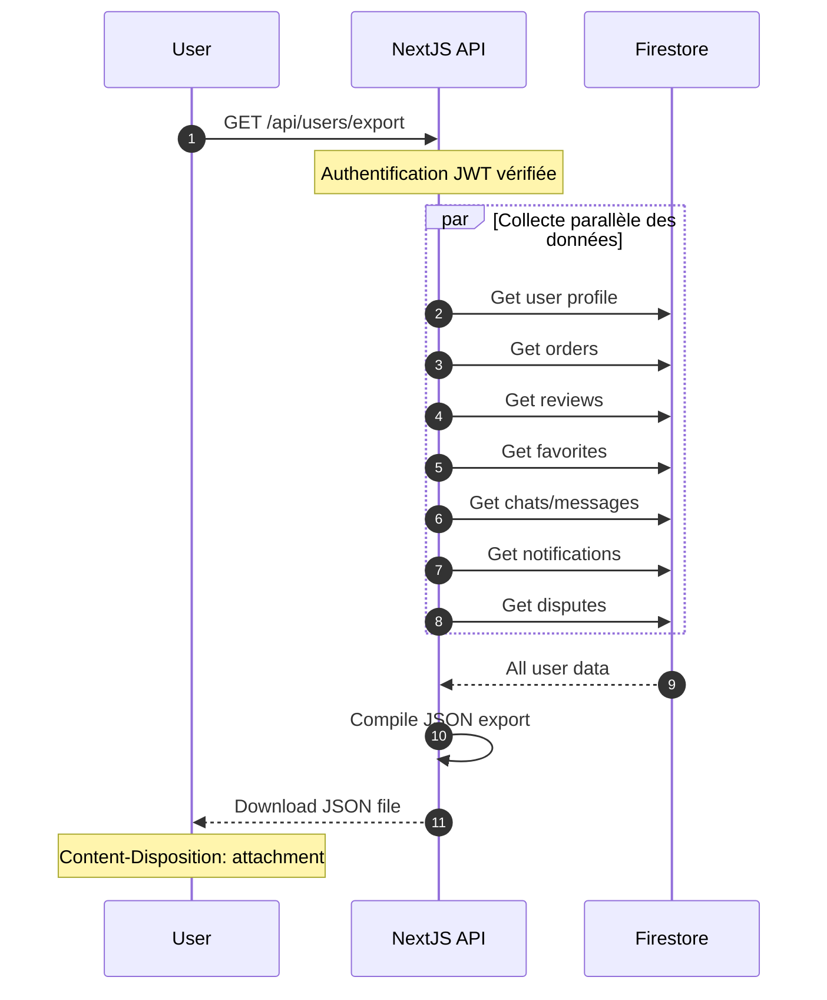

# Diagrammes de Séquence - GreenDrop

## 1. Flux de Commande Client (Order Flow)

## 2. Flux d'Inscription Livreur (Driver Onboarding)

## 3. Flux de Gestion de Litige (Dispute Flow)

## 4. Flux de Chat en Temps Réel

## 5. Flux d'Export RGPD

